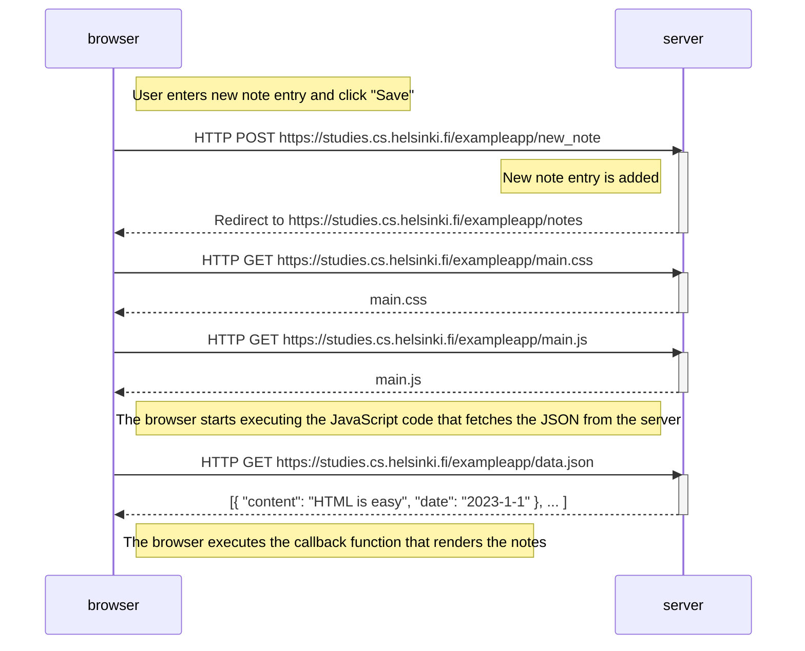

# Exercise 0.4

```mermaid
sequenceDiagram
    participant browser
    participant server

    Note right of browser: User enters new note entry and click "Save"

    browser->>server: HTTP POST https://studies.cs.helsinki.fi/exampleapp/new_note
    activate server

    Note left of server: New note entry is added

    server-->>browser: Redirect to https://studies.cs.helsinki.fi/exampleapp/notes
    deactivate server

    browser->>server: HTTP GET https://studies.cs.helsinki.fi/exampleapp/main.css
    activate server
    server-->>browser: main.css
    deactivate server

    browser->>server: HTTP GET https://studies.cs.helsinki.fi/exampleapp/main.js
    activate server
    server-->>browser: main.js
    deactivate server

    Note right of browser: The browser starts executing the JavaScript code that fetches the JSON from the server

    browser->>server: HTTP GET https://studies.cs.helsinki.fi/exampleapp/data.json
    activate server
    server-->>browser: [{ "content": "HTML is easy", "date": "2023-1-1" }, ... ]
    deactivate server

    Note right of browser: The browser executes the callback function that renders the notes

```
